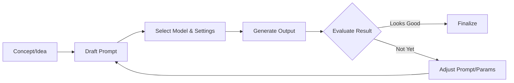

# Executive Summary  
Leonardo AI offers a **suite of cutting-edge generative models** for images and video. Each model (e.g. **Nano Banana**/Gemini 2.5, **Lucid Origin**, **Ideogram 3.0**, **Sora 2**, **Veo 3**, **Kling 3.0 (Omni)**, etc.) has unique strengths, inputs, and typical uses. This report breaks down each model’s capabilities and prompt techniques, then shares **cross-model prompt-engineering principles**, step-by-step workflows, troubleshooting tips, evaluation methods, and cheat-sheets. We include best-practice prompt templates, example prompts of various lengths, and illustrative Mermaid workflow charts. This should serve as a hands-on guide: clear, encouraging, and a little bit witty – because prompt engineering can be fun (and yes, a bit wild) when you know the ropes.

## 1. Leonardo AI Models Overview  
Leonardo.AI continually adds new models, both image and video. **Latest image models:**  
- **Nano Banana (Google Gemini 2.5 Flash Image):** Text-to-image and image-editing powerhouse. Inputs: text prompts (optionally plus an input image). Outputs high-res images. **Strengths:** superb at *logical consistency* (objects in the right place), handling text/rendered letters, and quick style transfers or edits on existing images. Ideal for concept art, product mockups, narrative scenes, fashion – basically any creative visual where detail and context matter. (Gemini’s massive size means Nano Banana can be a bit *slow/costly* on API calls – it’s a cloud-only model.)  
- **Lucid Origin:** Leonardo’s own generalist image model. Inputs: text prompts. Outputs clean, vibrant **Full-HD images**. **Strengths:** rich colors, sharp details, good prompt adherence and text legibility. It’s a “jack-of-all-styles,” excelling at realistic, digital-art, and hand-drawn looks. A great go-to for polished art or marketing visuals. **Limitations:** may need more style guidance (it’s a bit *neutral* by default).  
- **Ideogram 3.0:** Concept-art–focused model (from Stable Diffusion lineage). Inputs: text (with optional image styles). Outputs stylized images. **Strengths:** clear “conceptual” visuals, expressive outlines, and easier-to-interpret results for design work. **Limitations:** slightly less photo-realism; more illustrative. (It also supports negative prompts for fine-tuning background clutter.)  

**Latest video models:**  
- **Sora 2:** Text-to-video model for **multi-shot stories**. Input: a high-level prompt (can include a short screenplay or scene list). Outputs a short video (with motion & audio). **Strengths:** dynamic, cinematic scenes with coherent narrative flow. Great for short films, animated storyboards, or ad videos. **Limitations:** video length is limited (a few seconds per “shot”), so it works best with concise story beats.  
- **Veo 3:** Text-to-video model optimized for **single-scene generation**. Input: prompt (no screenplay needed). Outputs a video clip of a continuous scene. **Strengths:** stable visuals and background, good for looping actions or nature scenes. **Limitations:** less control over plot; best used for visual montages or environment showcases.  
- **Kling 3.0 (Omni):** Very advanced video model with **multi-shot and audio**. Input: a script or scene list (can include camera directions). Outputs a longer, filmic video with synchronized sound. **Strengths:** highest realism and continuity, 4K output, physics-aware motion. **Limitations:** very computationally heavy and (likely) expensive. Best for professional-like short films or music videos.  
- **O3 Omni:** (O3 likely shorthand for the third release of Kling’s Omni branch.) Combines Kling’s strengths with improved consistency. **Use case:** very demanding narrative videos with consistent characters/lighting over multiple shots.  

*(All model specifics and names are based on Leonardo AI’s documentation and community updates.)*  

## 2. General Prompt-Engineering Principles  
Across all models, the same **foundations** apply:  

- **Be Specific & Descriptive:** Give clear details on *subject, action, and context*. E.g. instead of “dog on couch,” try *“a golden retriever puppy sitting on a navy velvet couch in a sunlit living room”*. Specifics (colors, lighting, emotion, environment) guide the AI.  
- **Use Style Modifiers:** Add genre/style tags: “photorealistic,” “digital art,” “manga style,” “cinematic,” etc. Leonardo responds well to artistic cues (e.g. *“oil painting”*, *“3D render”*, *“film noir”*).  
- **Iterative Refinement:** Rarely is the first prompt perfect. Generate, review, tweak the prompt (add/remove words, change adjectives) and rerun. Use *step-by-step breakdowns* or numbered lists for complex scenes. For example, telling a story in bullet points can yield multi-part outputs (especially for Sora or Kling).  
- **Balance Detail vs. Creativity:** Overloading the prompt can confuse the model; too little detail makes it guess. Aim for concise but vivid descriptions.  
- **Vocabulary Matters:** Use concrete nouns and vivid adjectives. Swap vague words (e.g. “beautiful”) for specifics (“golden-orange sunset over cliffs”). The more “visual” the language, the better the generation.  
- **Leverage Negative Prompts:** Leonardo supports negative prompts (especially in advanced settings). Use them to *exclude* unwanted elements. Common negative tokens: *“blurry, out-of-focus, lowres, artifact, watermark, signature, text, ugly, extra limbs”*, etc. Be specific: *“no blur, no distortions”* ensures clarity.  
- **Adjust Hyperparameters:** Prompt engineering isn’t just text. Tweak *CFG/Guidance Scale*: higher values (like 12-15) force stricter adherence to the prompt; lower values (5-8) allow more creativity. Experiment! Also try different *samplers* (Euler, DDIM, etc.) and *steps* (50–100 steps often yields detail without oversmoothing).  
- **Seeding for Consistency:** Use a fixed random seed to reproduce results or iterate on the same “base” image. If you want variations, use different seeds.  
- **Frame-by-Frame Prompts (Video):** For video models, consider each shot’s prompt like a separate mini-prompt, but maintain a coherent style across shots (e.g. “Shot 1: ... , Shot 2: ...”). Use consistent character and setting descriptions to keep continuity.  

*(These best practices are in line with general generative-AI guidance【45†L1-L6】【52†L7-L13】.)*  

## 3. Model-Specific Prompt Patterns & Examples  
While general rules apply, each model has flavors of its own. Here are targeted tips and templates:  

- **Nano Banana (Image/Editing):**  
  - **Structure:** *Subject + Action + Context + Style*. Eg: *“A futuristic city skyline at dawn with neon lights, ultra-detailed, 8K resolution, photorealistic.”*  
  - **Editing Prompts:** Prepend phrases like *“Remove the background”*, *“Enhance the clouds”*, etc. Nano Banana excels at *instructions* (e.g. *“Make the sky stormy, add lightning in the background.”*).  
  - **Inpainting/Variants:** Use the “image reference” feature: upload an image and prompt transformation, e.g. *“Turn this daytime scene into a night street with rain.”* Leonardo’s guidance allows fine edits with text.  
  - **Example:** *“A portrait of a wise owl wearing steampunk glasses and a leather jacket, photorealistic, shallow depth-of-field”* yields an owl with detailed textures (glasses, feathers) and blurred background.  
  - **Negative Prompt Example:** If eyes are often too bright, add *“dull eyes, no glow”* to negative prompt.  

- **Lucid Origin (Image):**  
  - **Structure:** Similar to Nano Banana, but emphasize *aesthetic terms*. Eg: *“An elegant vintage car parked under cherry blossoms, film grain, sunset lighting, dramatic angle.”*  
  - **Modifiers:** Lucid shines with artistic descriptors: *“surreal”, “vibrant”, “cinematic”*. Also mention camera details (*“DSLR, 50mm lens, high contrast”*).  
  - **Example:** *“An enchanted forest with glowing mushrooms, ultra HD, by Studio Ghibli, 4k”* produces a whimsical, colorful scene.  
  - **Tip:** To boost realism, include real-world photography terms (lighting, lens, aperture).  

- **Ideogram 3.0:**  
  - **Structure:** Focus on concept clarity. Eg: *“Diagram of solar system with labeled planets, clean vector style, white background.”*  
  - **Steps:** Break complex scenes into bullets or steps:  
    1. *“Create a scene of a dragon flying above a medieval castle.”*  
    2. *“Add lightning in the sky.”*  
  - **Example:** *“A serene meditation scene: 1. A person sitting cross-legged on a mountain peak. 2. Golden sunrise in the background. 3. Ethereal light rays.”* This can yield a multi-layered composition.  
  - **Negative Prompt:** Use negative for unwanted detail: e.g. *“no text, no logo, no cartoon”* if you want realism.  

- **Image-to-Image (All models):**  
  - Upload an image to guide style or composition. Prompt could be: *“Take this photo and render it in cyberpunk style”* or *“Convert this sketch into a watercolor painting.”*  
  - For variation, specify which elements change: *“Replace the forest with a city at night, keep the camera angle.”*  

- **Style Transfer:**  
  - Add *“in the style of [artist/movement],”* e.g. *“in the style of Van Gogh”* or *“Art Nouveau style.”* Combine with subject: *“A bustling market street, ornate Art Nouveau style.”*  

- **Video (Sora/Veo/Kling/O3):**  
  - **Shot-by-Shot:** For Sora and Kling, write the prompt as a sequence of shots. For example:  
    - *“Shot 1: A lonely hero on a mountain overlooking a storm. Cinematic lighting. Shot 2: Close-up of the hero’s determined face. Dramatic music starts.”*  
  - **Scene Description:** For Veo, a single-shot prompt suffices: *“A gentle snowstorm over a calm village at dusk, soothing background music.”*  
  - **Modifiers:** Include camera movements (*“pan right, slow zoom”*) or cinematic terms (*“wide angle, epic orchestral score”*).  
  - **Example (Sora):** *“Shot 1: A spaceship docks at a neon spaceport. Camera pans down. Shot 2: Crew member steps off, wearing a red uniform, anxious expression.”* This yields a short video with those two scenes.  
  - **Example (Veo):** *“A serene beach with waves and a sunset, realistic style, calming ambient sound.”* Gives a looping nature clip.  

*(These patterns combine best practices from Leonardo’s docs and community tips.)*  

## 4. Iteration Workflow (Prompts & Hyperparameters)  
A **step-by-step cycle** ensures the best results. For example:

**Detailed Workflow:**  
1. **Initial Prompt:** Start with a basic descriptive prompt (subject, setting, mood).  
2. **Model/Settings:** Pick the appropriate Leonardo model. Adjust CFG scale (try 7–12), sampling steps (50–100), and resolution.  
3. **Generate & Review:** Examine the output. Check if the subject is present, style is right, and unwanted artifacts are absent.  
4. **Refine Prompt:** If issues appear, *tweak the prompt*:  
   - Missing detail? Add descriptors (*“taller trees in background”*).  
   - Unwanted objects? Use a negative prompt (*“no vehicles, no people”*).  
   - Wrong style? Change or add style terms (*“in watercolor style”*).  
5. **Adjust Hyperparameters:**  
   - *Increase steps* for finer detail or *change sampler* if the image looks noisy.  
   - *Raise CFG scale* if the image drifts from the prompt; *lower it* if it’s too rigid.  
6. **Seed Control:** To compare changes, use the same seed for re-runs, or use a new seed to explore variety.  
7. **Repeat:** Regenerate until the image/video matches your intent. 

For video models, the loop is similar, but evaluate continuity and motion: you might need to split the story into more or fewer shots, or adjust timing. Adding or removing detail in each shot’s prompt can fix pacing or focus.  

*(Workflow based on common prompt iteration strategies【45†L1-L6】【54†L9-L12】.)*  

## 5. Troubleshooting & Common Failures  
**Issue:** *Subject Missing/Deformed* –  Fix: Make the subject more prominent (move it to the start of the prompt, or add adjectives). Use explicit phrases like “clearly visible” or reference (e.g. “as the focal point”). If body parts are wrong, try “realistic human, anatomically correct.”  
**Issue:** *Weird Text or Symbols* –  Fix: Many models struggle with text. Use negative tokens like “no text, no lettering.” If you want text, specify style (“clean signage in background”).  
**Issue:** *Blurry or Low-detail Image* –  Fix: Increase resolution or steps. Add details/adjectives in prompt (color, pattern, texture). Use “ultra-detailed, sharp focus, 8k” to encourage clarity.  
**Issue:** *Odd Colors/Lighting* –  Fix: Describe the lighting explicitly (“warm afternoon sun”, “dramatic studio light”). For colors, use exact terms (“emerald green, rusty red”). Negative prompt “no oversaturation” if needed.  
**Issue:** *Repetitive or Unwanted Objects* –  Fix: If random duplicates appear, try a negative prompt (“no extra person, no repeated buildings”). You can also split the prompt into separate phases (especially in Ideogram).  
**Issue:** *Loss of Perspective or Proportions* –  Fix: Add perspective cues: “aerial view, low angle, depth of field”. If body proportions are off, say “realistic human anatomy.”  
**Issue:** *Unstable Video Frames/Jitter* –  Fix: For video, ensure you mention “consistent characters/lighting.” Use the same seed across shots if possible. Simplify the scene or increase frame count to smooth motion.  
**Issue:** *Hardware/Time Constraints* –  Fix: Lower resolution or steps for faster results, then refine the best one. Focus on key elements first (e.g., generate the main subject at high quality, then add background separately).  

Remember: **Patience is key**. If something looks off, tweak one thing at a time (prompt word or a parameter) and see the effect. Leonardo’s community often recommends isolating variables: e.g. change only the negative prompt to see its impact. 

## 6. Evaluation Metrics  
Assessing output quality is part art, part science:

- **Prompt Alignment (Relevance):** Check if generated content matches the prompt. Automated CLIP-based metrics can score prompt-image similarity. Manually, count required objects, verify scene elements, or use tools like BLIP (image-captioning) to see if it “reads” your subject.  
- **Visual Quality:** Look for sharpness, absence of artifacts (blurs, glitches). Quantitatively, metrics like FID (Frechet Inception Distance) compare distributions, but for single outputs focus on detail and texture.  
- **Style Fidelity:** If following an artistic style, compare to style references or known outputs. For example, measure color histograms or consult a style classifier.  
- **Video Coherence:** For videos, use *temporal consistency metrics* (like flow consistency) to ensure frames transition smoothly. Also check audio-sync if applicable.  
- **Human Evaluation:** Ultimately, user feedback or your own judgement is crucial. For professional use, A/B tests or preference scores (do viewers prefer Prompt A vs B?) are common.  
- **Technical Checks:** Ensure resolution and aspect ratio match requirements. Check metadata (some models allow embedding prompt and seed in output).

*(See generative model literature for automated metrics; e.g. CLIPScore for text-image relevance.)*  

## 7. Tools, UIs, and Integrations  
- **Leonardo.AI Platform:** The primary UI includes prompt fields, advanced settings (for negative prompts, CFG, sampler), and image/video upload. It also offers *“Improve Prompt”* features that rewrite or refine prompts automatically.  
- **Leonardo API:** Developers can use the REST API to integrate Leonardo models into apps or pipelines. (You’ll use endpoints like `/generate/image` or `/generate/video` with JSON prompts. Refer to Leonardo’s API docs for auth and parameters.)  
- **Community Tools:**  
  - **Replicate and Hugging Face:** Many Leonardo models are mirrored or wrapped on Replicate/HF, allowing offline testing or model exploration. For instance, “lucid-origin” and others may exist there (useful for experimenting with different UIs).  
  - **Prompt Assistants:** Sites like BananaPrompts.com or AIArtHouse sometimes catalog high-quality Leonardo prompts for inspiration.  
  - **Generic UIs:** Stable Diffusion GUIs (e.g. Automatic1111, InvokeAI) can be used if Leonardo’s models are available to run (via LoRA/Checkpoints). For on-platform, stick to Leonardo’s integrated environment.  
  - **Collaboration/Sharing:** Leonardo has community galleries and Discords where artists share prompts and tips. Use these to learn which prompts work best (and often copy-paste to experiment).  
- **Integrations:**  
  - **No-code tools:** Leonardo can be plugged into automation platforms (Zapier, Make) via API to generate images on the fly from spreadsheets or form inputs.  
  - **Design Software:** Plugins or scripts (e.g. for Photoshop, Figma) might allow sending a selected region to Leonardo for editing.  

**Recommended Flow:** Draft prompts in a text editor or Notion, test in Leonardo’s UI, then use the API to automate batches. Save seeds and prompts for reproducibility.  

## 8. Cheat-Sheet: Prompt Tokens & Modifiers  

- **General Enrichers:** `ultra-detailed`, `hyper-realistic`, `8k`, `photorealistic`, `trending on artstation`, `award-winning photo`, `sharp focus`, `elegant`, `vibrant`.  
- **Art Styles/Mediums:** `oil painting`, `watercolor`, `pencil sketch`, `digital art`, `3D render`, `anime style`, `cyberpunk`, `noir`, `vaporwave`, `impressionism`.  
- **Lighting & Camera:** `backlit`, `soft light`, `cinematic lighting`, `bokeh`, `macro`, `wide-angle lens`, `golden hour`, `studio portrait`.  
- **Compositional Phrases:** `wide shot`, `close-up`, `top-down view`, `over-the-shoulder`, `symmetrical`, `dynamic angle`, `rule of thirds`.  
- **Scene Modifiers:** `futuristic city`, `ancient ruins`, `magical forest`, `rainy night`, `sunset`, `highly detailed background`, `minimalist`.  
- **Color & Mood:** `vivid colors`, `pastel palette`, `monochrome`, `neon-lit`, `warm hues`, `cool tone`, `moody atmosphere`.  
- **Quality Enhancers:** `high resolution`, `ray-traced reflections`, `cinematic color grading`, `film grain`, `sharp edges`.  
- **Action/Emotion:** `smiling`, `angry expression`, `running`, `dancing`, `whispering`, `surprised`.  
- **Character/Subject Tags:** *For people:* `portrait`, `full body`, `elderly`, `teen`, `muscular`, `dressed in [fashion style]`; *For animals:* `fluffy`, `nocturnal`; *For objects:* `rusty`, `futuristic`.  
- **Negative Tokens:** `blurry`, `lowres`, `distorted`, `deformed`, `mutated`, `rain`, `watermark`, `signature`, `clutter`, `text`, `long body`, `extra limbs`, `ugly`, `unrealistic`, `grainy`.  

Keep this cheat-sheet handy to **mix and match**. For example, a template could be:  
> **“[Main Subject], [vivid adjective] [setting], [style/medium], [lighting detail], [composition], ultra high definition.”**  
And a negative example:  
> **“Negative: [undesired traits], [abstract term]”**.  

## 9. Model Comparison & Prompt Templates  

| Model (Type)               | Key Features                                | Use Cases                         | Example Prompt Template                              |
|----------------------------|---------------------------------------------|-----------------------------------|------------------------------------------------------|
| **Nano Banana** (Image)    | Advanced editing, strong logic & text understanding (Gemini 2.5) | Concept art, product design, narrative scenes | *“A [adjective] [subject] [action] in [setting], photorealistic, UHD, cinematic lighting.”* |
| **Lucid Origin** (Image)   | Sharp details, vibrant color, generalist  | Marketing visuals, illustrations, portraits  | *“[Subject] wearing [clothing], [lighting] lighting, [camera/style], high detail.”*   |
| **Ideogram 3.0** (Image)   | Conceptual clarity, illustrative         | Diagrams, storyboards, concept art      | *“Step-by-step: 1. [Scene detail]. 2. [Next detail]. [Overall style].”*                |
| **Sora 2** (Video)         | Multi-shot narratives, cinematic         | Short films, anime scenes, storytelling   | *“Shot 1: [description]. Shot 2: [description]. [Global style/music].”*                |
| **Veo 3** (Video)          | Single-shot scene, smooth loops           | Scenic loops, product demos, mood visuals | *“A [scene description], photorealistic, [background sound].”*                          |
| **Kling 3.0 (Omni)** (Video) | High realism, multi-shot, audio sync     | Film-quality short videos, ads           | *“Sequence: 1. [scene]. 2. [scene]. (Cinematic camera, [lighting]).”*                   |
| **O3 Omni** (Video)        | Character consistency, dynamic scenes    | Extended narratives, series pilots       | *“Detailed script: [detailed scene instructions step by step with characters].”*        |

*(Each “Example Prompt” is a template – replace bracketed parts with your scene details.)*  

## 10. Example Prompts & Expected Outputs  

- **Short Prompt (Concise):**  
  *Prompt:* “**A cat astronaut floating in space, photorealistic, 8k**.”  
  *Expected:* An image of a cat in a space suit against a starry background. The cat looks detailed (fur visible), the spacesuit has reflections, and the stars or planet in background are sharp. If using Nano Banana, the cat’s expression should be clear; if Lucid, colors will be vibrant.  

- **Medium Prompt (Detail):**  
  *Prompt:* “**A bustling cyberpunk city at night, neon signs, rain-soaked streets reflecting lights, in the style of Blade Runner, ultra-detailed**.”  
  *Expected:* A moody cityscape with towering skyscrapers, numerous neon advertisements (maybe in Asian scripts), and wet pavement reflecting those lights. The atmosphere is foggy/rainy, people with umbrellas. The image is rich with detail and styled like a scene from a sci-fi film.  

- **Long Prompt (Highly Detailed):**  
  *Prompt:* 
  > “**A medieval village market square at dawn. Foreground: a wooden stall with fruits and vegetables, morning light casting long shadows. Middle: peasants and traders haggling, a cobblestone path leading to a stone fountain. Background: misty forest and castle on a hill. Film still, golden hour lighting, ultra high resolution.**”  
  *Expected:* A layered scene: the fruit stall is crisp with visible textures; villagers in period clothing; cobblestones glistening with dew. The castle and trees are softly lit by sunrise. The whole image looks like a still frame from a fantasy movie, with realistic lighting and depth.  

*(For each example above, the actual output may vary by model choice. The descriptions under “Expected” assume optimal generation with the right model and settings.)*  

These examples showcase how increasing prompt length/complexity yields more context in the output. Feel free to experiment: the same core idea (“cat astronaut” or “cyberpunk city”) can be tweaked with more/less detail or different style tags to see varied results. Remember to adjust negative prompts if any undesired elements (like extra cats or cartoon-like rendering) appear.

---

**Key Takeaway:** By combining clear, detailed prompts with model-specific strategies and iterative refinement, you can harness Leonardo AI’s latest models to produce stunning images and videos. Use the cheat-sheets and workflows above, and don’t hesitate to play around – prompt engineering is as much creativity as it is technique. Enjoy the process, learn from each generation, and you'll level up fast!